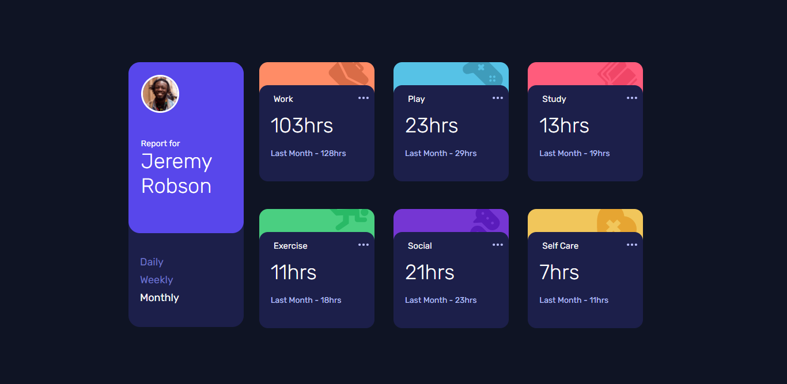

# Frontend Mentor - Time tracking dashboard solution

This is a solution to the [Time tracking dashboard challenge on Frontend Mentor](https://www.frontendmentor.io/challenges/time-tracking-dashboard-UIQ7167Jw). Frontend Mentor challenges help you improve your coding skills by building realistic projects. 

## Table of contents

- [Overview](#overview)
  - [The challenge](#the-challenge)
  - [Screenshot](#screenshot)
  - [Links](#links)
- [My process](#my-process)
  - [Built with](#built-with)
  - [What I learned](#what-i-learned)


## Overview


### The challenge

Users should be able to:

- View the optimal layout for the site depending on their device's screen size
- See hover states for all interactive elements on the page
- Switch between viewing Daily, Weekly, and Monthly stats

### Screenshot



### Links

- Solution URL: [https://samwahome.github.io/time-tracking-dashboard/](https://samwahome.github.io/time-tracking-dashboard/#)
- Live Site URL: [https://samwahome.github.io/time-tracking-dashboard/](https://samwahome.github.io/time-tracking-dashboard/)

## My process

### Built with

- Semantic HTML5 markup
- CSS custom properties
- Flexbox

### What I learned

I learnt to do flex wrap. This easily fixes issues to do with creating responsive layouts. I also got to center elements easily with justify-content.

To see how you can add code snippets, see below:

Flex Wrap:

```html
<div class="container wrap">
  <div class="item">My Wrapping Content</div>
</div>
```
```css
.container{
  max-width:95%;
}
.item {
  width: 200px;
}
.wrap {
  flex-wrap: wrap;
}
```

Simply using JavaScript without a framework is a great challenge to overcome. Below is how I switch values:
```js
  function updateTimes(el,duration = 0){
    let bodyElement = document.getElementsByTagName("body");
    bodyElement[0].removeAttribute("class");
    parent = el.parentNode;
    var firstLi = document.querySelectorAll('li.active')[0];
    firstLi.removeAttribute("class");
    parent.setAttribute("class","active");
    if(duration === 1){
      bodyElement[0].setAttribute("class","daily-active");
    }
    if(duration === 2){
      bodyElement[0].setAttribute("class","weekly-active");
    }
    if(duration === 3){
      bodyElement[0].setAttribute("class","monthly-active");
    }
    return false;
  }
```